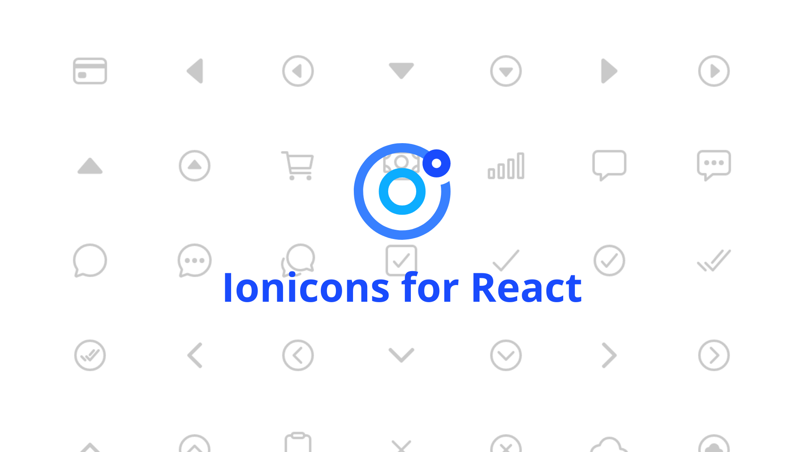

# Ionicons React Component



This package contains a React Component, which implements the latest version of the official [Ionicons](https://github.com/ionic-team/ionicons) into React.

## Installation 📦

To add the package to your existing React project just type in one of the following commands:

```
npm i @reacticons/ionicons
```

or

```
yarn add @reacticons/ionicons
```

## Usage

```js
import React from 'react';
import IonIcon from '@reacticons/ionicons';

export const Component = () => (
  <>
    <IonIcon name="bag-outline" />
  </>
);
```

### Custom Size

You can specify the icon size by using the optional `size` prop.

```js
<IonIcon name="bag-outline" size="small" />
<IonIcon name="bag-outline" size="large" />
```

## Supported Icons

This package supports all Ionicons of the matching version. To see a full list of them, you can take a look at the official [Ionicons website](https://ionicons.com/).

## Hint

By the way, the `<IonIcon>` Component has the same attributes as a typical `<span>` element.
